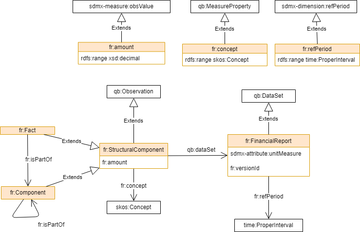

Financial Report Vocabulary (FR)
=================================

FR is a simple [OWL vocabulary](https://www.w3.org/TR/owl2-primer/) to describe a generic financial report.

The FR vocabulary can be used to capture different perspectives of a report data like historical trends, cross-department and component breakdown. 

FR extends the [W3C RDF Data Cube Vocabulary](https://www.w3.org/TR/vocab-data-cube) and it is inspired by the [Financial Report Semantics and Dynamics Theory](doc/Theory-2017-06-26.pdf). 

A **FinancialReport** is a dataset that contains a hierarchy of **Component**s. The leaves of the financial report components tree are the **Facts**.
A **Fact** is an observation of a money amount described with some *properties* that is reported in the Financial Report.

Facts and components SHOULD be related to one or more **Concept** in a  [SKOS vocabulary](https://www.w3.org/TR/skos-primer) taxonomy.

The following namespaces are used:

Prefix          | Namespace                                         | Description
--------------- | ------------------------------------------------- | ----------------
fr              | http://linkeddata.center/botk-fr/v1#              | this vocabulary
qb              | http://purl.org/linked-data/cube#                 | W3C RDF Data Cube Vocabulary
skos            | http://www.w3.org/2004/02/skos/core#              | the W3C SKOS vocabulary
time            | http://www.w3.org/2006/time#                      | the W3C ontology of temporal concepts
sdmx-code       | http://purl.org/linked-data/sdmx/2009/code#       | SKOS Concepts and ConceptSchemes for each COG defined code list
sdmx-dimension  | http://purl.org/linked-data/sdmx/2009/dimension#  | component properties corresponding to each COG concept that can be used as a dimension
sdmx-attribute  | http://purl.org/linked-data/sdmx/2009/attribute#  | component properties corresponding to each COG concept that can be used as an attribute
sdmx-measure    | http://purl.org/linked-data/sdmx/2009/measure#    | component properties corresponding to each COG concept that can be used as a measure




Some fact properties, if not explicitly defined, can be inherited from the financial report attributes, that provide a fall-back default. 
In some cases, the financial report components hierarchy can be inferred from the concepts taxonomy structure.

The *fr:FinancialReport* class allows to annotate any Financial report. It is a dataset (qb:DataSet) and can be further specialized as needed.

```
:2018_budget_report a qb:DataSet fr:FinancialReport ;
	fr:refPeriod <http://reference.data.gov.uk/id/gregorian-interval/2018-01-01T00:00:00/P1Y> ;
	sdmx-attribute:unitMeasure <http://publications.europa.eu/resource/authority/currency/EUR> 
```

The *fr:Fact* class is a specialization of the qb: Observation class belonging to a financial report and it is used for annotating an atomic amount of money. 
The *Fact* meaning is specified by a SKOS concept that can be related to a formal taxonomy (i.e. SKOS scheme)

```
:fact_x a qb:Observation, fr:Fact;
    fr:concept :level_2_account ;
    qb:dataSet :2018_budget_report ;
    fr:amount 188149000000.00  .

:level_2_account a skos:Concept ;
    skos:broader :level_1_account; 
    skos:inScheme :budgetTaxonomy  .

:budgetTaxonomy a skos:ConceptScheme;
    skos:hasTopConcept :level_1_account; 
    skos:inScheme :budgetTaxonomy  .
```

The money currency can be defined as a fact property or inherited from the related Financial report.

The *fr:Component* class is a financial report observable that aggregates facts or of other components. Like  facts, the components must be related to a SKOS concept and have an amount of money associated, but this amount is supposed to be calculated somehow from referenced facts or component (usually is a sum).

```
:component_z a fr:Component;
    fr:concept :level_1_account;
    qb:dataSet :2018_budget_report ;
    fr:amount 288149000000.00 ;
    fr:hasPart :fact_x, :fact_y.
```

Components and facts define the structure of the financial report as a tree

The concept taxonomies describe the meaning of the reported figures. 


## Using the FR vocabulary

The FR vocabulary can be used as a solid base to build application profiles that analyze budgets, balances and any financial reports.

For example of FR  see [g0v fr-ap application profile](https://github.com/g0v-it/ontologies/blob/master/fr-ap/README.md)

## Editing

The namespace for FR terms is *http://linkeddata.center/botk-fr/v1#*

The suggested prefix for the FR vocabulary namespace is *fr*

FR is expressed in a [owl file](fr.owl) serialized as RDF xml. You can edit the file by hand or using [Protégé](https://protege.stanford.edu/)

## License

The FR ontology is available under the Creative Commons Attribution 4.0 license.
